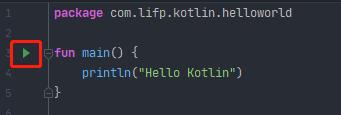

[TOC]

# Kotlin学习

## 1. Kotlin简单介绍

Kotlin是由JetBrains公司开发和设计的，早在2011年，JetBrains就公布了Kotlin的第一个版本，并在2012年将其开源，但在早期，它并没有受到太多的关注。

2016年，Kotlin发布了1.0正式版，这代表着Kotlin已经足够成熟和稳定了，并且JetBrains也在自家的旗舰IDE开发工具IntelliJ IDEA中加入了对Kotlin的支持，自此Android开发语言终于有了另外一种选择，Kotlin逐渐受到广泛的关注。

2017年Google宣布Kotlin正式成为Android一级开发语言，Android Studio也加入了对Kotlin的支持，Kotlin自此开始大放异彩。

Kotlin的语法更加简洁，对于同样的功能，使用Kotlin开发的代码量可能会比使用Java开发的减少50% 甚至更多。另外，Kotlin的语法更加高级，相比于Java比较老旧的语法，Kotlin增加了很多现代高级语言的语法特性，使得开发效率大大提升。还有，Kotlin在语言安全性方面下了很多工夫，几乎杜绝了空指针这个全球崩溃率最高的异常。

然而Kotlin在拥有众多出色的特性之外，还有一个最为重要的特性，那就是它和Java是100%兼容的。Kotlin可以直接调用使用Java编写的代码，也可以无缝使用Java第三方的开源库。这使得Kotlin在加入了诸多新特性的同时，还继承了Java的全部财富。

为了方便开发者快速体验Kotlin编程，JetBrains专门提供了一个可以在线运行Kotlin代码的网站，地址是：https://try.kotlinlang.org。但是在线运行Kotlin代码有一个很大的缺点，就是使用国内的网络访问这个网站特别慢，而且经常打不开。所以可以在Android Studio中直接运行Kotlin代码，在MainActivity所在的位置，创建一个kt文件，在kt文件中编写如下代码



这里的main就相当于Java中的main主函数，点击红框中的三角运行按钮即可直接运行Kotlin代码。

## 2. 变量和函数

### 2.1 变量

Kotlin中只允许在变量前声明两种关键字：val和var。

val（value）用来声明一个不可变的变量，这种变量在初始化赋值之后就再也不能重新赋值，相当于Java中的final变量。

var（variable）用来声明一个可变的变量，这种变量在初始化赋值之后还可以被重新赋值，对应Java中的非final变量。

Kotlin拥有出色的类型推导机制。下面我们举例说明一下。

```kotlin
fun main() {
    val a = 10   // 注意一下 Kotlin每一行代码的结尾是不需要加 分号 的
}
```

我们用val关键字定义了一个变量a，它被赋值为10，这里a就会被自动推导成整型变量。

当然Kotlin也支持显式的声明变量类型，如法如下：

```kotlin
val a: Int = 10
```

这里我们显式的声明了变量a的类型为Int。Kotlin中Int的首字母是大写的，Java中是小写的，这是因为Kotlin的基本数据类型全部使用了对象数据类型。在Java中int是关键字，而在Kotlin中Int变成了一个类，它拥有自己的方法和继承结构。下表列举了Java中的数据类型对应的Kotlin的数据类型。

| Java基本数据类型 | Kotlin对象数据类型 | 数据类型说明 |
| ---------------- | ------------------ | ------------ |
| int              | Int                | 整型         |
| long             | Long               | 长整型       |
| short            | Short              | 短整型       |
| float            | Float              | 单精度浮点型 |
| double           | Double             | 双精度浮点型 |
| boolean          | Boolean            | 布尔型       |
| char             | Char               | 字符型       |
| byte             | Byte               | 字节型       |

接下来我们尝试对变量a进行一些运算，比如让a变大10倍。

```kotlin
fun main() {
    val a: Int = 10
    a = a * 10
    println(a)
}
```

如果这样写的话编译器就会提示我们错误：`Val cannot be reassigned`，这是告诉我们使用val关键字定义的变量不能被重新赋值。所以我们可以将val修改为var即可。

### 2.2 编译时常量

**编译时常量只能在函数之外定义**，因为编译时常量必须在编译时赋值，而函数都是在运行时才调用，函数内的变量也是在运行时赋值，编译时常量要在这些变量赋值前就已存在。

```kotlin
const val MAX = 200 // 相当于public static final
fun main() {
    const val MAX = 4 // 如果在函数内定义就会报错
}
```

### 2.3 函数

函数就是我们通常说的方法，一个含义。Kotlin中定义函数的语法规则如下：

```kotlin
fun largeNumber(param1: Int, param2: Int) Int {
    return max(param1, param2)
}
```

首先fun（function）是定义函数的关键字，无论什么函数都必须要使用fun来声明，methodName是函数名，括号里边是函数可接收的参数，参数的个数可以是任意多个。参数的声明格式是“参数名：参数类型”。括号后边的部分是可选的，用于声明函数返回值类型，上述表示返回一个Int类型的数据，如果不需要返回值就可以不写。

Kotlin函数的语法糖，当一个函数中只有一行代码时，可以不必编写函数体，可以直接将代码写在函数定义的尾部，中间用等号连接即可。示例如下：

```kotlin
fun largeNumber(param1: Int, param2: Int) Int = max(param1, param2)
// 由于Kotlin具有类型推导机制，所以还可以这样写。
fun largeNumber(param1: Int, param2: Int) = max(param1, param2)
```

默认值参：如果不打算传入值参，可以预先给参数指定默认值。

具名函数参数：如果使用命名值参，就可以不用管值参的顺序。

```kotlin
fun fix(name: String, age: Int = 2) {
    println(name + age)
}

fun main() {
    fix(age=4, name="Jack")
}
```

Kotlin可以使用空格和特殊字符对函数命名，不过函数名需要用一对反引号括起来。为了支持Kotlin和Java互操作，但是Kotlin和Java有不同的保留关键字，不能作为函数名使用，使用反引号括起来就能避免冲突。

```kotlin
fun `**~special function with weird name**`() {
    println("I am weird.")
}

fun main() {
    `**~special function with weird name**`()
    // 调用Java类中的is方法，is在Kotlin中是保留关键字
    MyJava.`is`()
}
```

## 3. 程序的逻辑控制

程序的执行语句主要分为三种：顺序语句、条件语句和循环语句。

### 3.1 if条件语句

与Java中的几乎没什么区别。

```kotlin
fun largeNumber(num1: Int, num2: Int) : Int {
    // 这里使用var定义变量，因为我们初始化了，在条件内部还会重新赋值
    var value = 0
    if (num1 > num2) {
        value = num1
    } else {
        value = num2
    }
    return value
}
```

Kotlin中的if语句相比Java有一个额外的功能，它是可以有返回值的，返回值就是if语句每一个条件中最后一行代码的返回值。

```kotlin
fun largeNumber(num1: Int, num2: Int) : Int {
    // 这里使用了val定义变量，此时没有进行初始化而且也不需要重新赋值，所以可以使用val定义
    val value = if (num1 > num2) {
        num1
    } else {
        num2
    }
    return value
}
// 还可以这样写
fun largeNumber(num1: Int, num2: Int) : Int {
    return if (num1 > num2) {
        num1
    } else {
        num2
    }
}
// 还可以这样
fun largeNumber(num1: Int, num2: Int) = if (num1 > num2) {
    num1
} else {
    num2
}
// 甚至还可以这样
fun largeNumber(num1: Int, num2: Int) = if (num1 > num2) num1 else num2
```

### 3.2 when条件语句

我们先写一个查询成绩的例子：

```kotlin
fun getScore(name: String) = if (name = "Tom") {
    86
} else if (name = "Jim") {
    77
} else if (name = "Jack") {
    95
} else if (name = "Lily") {
    100
} else {
    0
}
```

可以看出有很多if else，代码看起来很冗余，我们使用when语句

```kotlin
fun getScore(name: String) = when (name) {
    "Tom" -> 86
    "Jim" -> 77
    "Jack" -> 95
    "Lily" -> 100
    else 0
}
```

这样看起来代码是不是瞬间清爽了很多。when语句允许传入一个任意类型的参数，格式：

`匹配值 -> { 执行逻辑 }` 当执行逻辑只有一行代码时，{ }可以省略。

除了精确匹配外，when还允许类型匹配，举个例子：

```kotlin
fun checkNumber(num: Number) {
    when (num) {
        is Int -> println("number is Int")
        is Double -> println("number is Double")
        else -> println("number not support")
    }
}
```

上述代码中，is关键字就是核心，它相当于Java中的Instanceof关键字。checkNumber接收的是一个Number类型的参数，这是Kotlin内置的一个抽象类，像Int、Long、Float、Double等于数字相关的类都是它的子类。所以这里可以使用类型匹配来判断传入的参数到底是什么类型。还有另一种写法如下

```kotlin
fun getScore(name: String) = when {
    name == "Tom" -> 86
    name == "Jim" -> 77
    name == "Jack" -> 95
    name == "Lily" -> 100
    else -> 0
}
```

Kotlin中判断字符串或者对象是否相等可以直接使用`==`关键字，跟Java不同。可能你会觉得写很多name冗余，但有些场景必须这样写，比如以`Tom`开头的分数都是86分。

```kotlin
fun getScore(name: String) = when {
    name.startsWith("Tom") -> 86
    name == "Jim" -> 77
    name == "Jack" -> 95
    name == "Lily" -> 100
    else -> 0
}
```

### 3.3 循环语句

Kotlin中与Java一样也有两种循环语句：for循环和while循环，其中while循环与Java中的while循环没有任何区别，在此不做介绍。Kotlin中舍弃了Java中的for-i循环，对Java中常用的for-each循环进行了大幅度的加强，变成了for-in循环。首先介绍一下Kotlin中区间的概念。

```kotlin
val range = 0..10
```

上述代码表示创建了一个0到10的区间，并且两端都是闭区间，这意味着0到10这两个端点都是包含在区间中的，用数学的方式表达出来就是[0, 10]。其中，..是创建两端闭区间的关键字，在..的两边指定区间的左右端点就可以创建一个区间了。

接下来我们遍历这个区间，结果如下图。

```kotlin
fun main() {
    for (i in 1..10) {
        println(i)
    }
}
```


很多时候双端闭区间不如单端闭区间好用，为什么呢？因为数组的下标都是以0开始的，一个数组长度为10的数组，它的下标范围是0-9，因此左闭右开的区间更常用。Kotlin中可以使用`until`关键字创建一个左闭右开区间，如下：

```kotlin
val range = 0 until 10
```

上述代码表示创建了一个0到10的左闭右开区间，它的数学表达方式是[0, 10)。修改main()函
数中的代码，使用until替代..关键字，你就会发现最后一行10不会再打印出来了。

默认情况下，for-in循环每次执行循环时会在区间范围内递增1，相当于Java for-i循环中
i++的效果，而如果你想跳过其中的一些元素，可以使用step关键字：

```kotlin
fun main() {
    for (i in 0 until 10 step 2) {
        println(i)
    }
}
```

上述代码表示在遍历[0, 10)这个区间的时候，每次执行循环都会在区间范围内递增2，相当于
for-i循环中i = i + 2的效果。现在重新运行一下代码，结果如下图所示。


前面所学的`..`和`until`关键字都要求区间的左端必须小于右端，也就是区间都是一个升序，如果想创建一个降序的区间，可以使用downTo关键字：

```kotlin
fun main() {
    for (i in 10 downTo 1) {
        println(i)
    }
}
```

这里我们创建了一个[10, 1]的降序区间，运行结果如下：


另外，降序区间也是可以结合step关键字跳过区间中的一些元素的。

### 3.4 String模板

模板支持在字符串的引号内放入变量值，也支持字符串里计算表达式的值并插入结果，添加在${}中的任何表达式，都会作为字符串的一部分求值。

```kotlin
fun main() {
    val origin = "Jack"
    val dest = "Rose"
    println("${origin} love ${dest}")
    
    val flag = false
    println("Answer is: ${if(flag) "我可以" else "对不起"}")
}
```

## 4. 匿名函数与函数类型

### 4.1 匿名函数

定义时不取名字的函数称之为匿名函数，**匿名函数通常整体传递给其他函数，或者从其他函数返回**。匿名函数对Kotlin很重要，有了它，我们能够根据需要制定特殊规则，轻松定制标准库里的内置函数。

```kotlin
fun main() {
    val total = "Mississipi".count()
    // 获取字符串的长度
    println(total)
    
    val totalS = "Mississipi".count({letter ->
		letter == 's'
    })
    // 获取字符串中s的数量
    println(totalS)
}
```

### 4.2 函数类型与隐式返回

匿名函数可以当做变量赋值给函数类型变量，就像其他变量一样，匿名函数就可以在代码里传递了。变量有类型，变量可以等于函数，函数也会有类型。**函数的类型，由传入的参数和返回值类型决定。**

和具名函数不一样，除了极少数情况外，匿名函数不需要return关键字来返回数据，匿名函数会隐式或**自动返回函数体最后一行语句的结果。**

```kotlin
// 定义一个变量，此变量的类型是函数类型，一个匿名函数
val blessingFunction : () -> String
    blessingFunction= {
        val holiday = "happy year."
        "Happy $holiday"
    }
println(blessingFunction())

// 还可以这样写
val blessingFunction : () -> String = {
    val holiday = "happy year."
    "Happy $holiday"
}
```

### 4.3 函数参数

和具名函数一样，匿名函数可以不带参数，也可以带一个或多个任何类型的参数，需要带参数时，**参数的类型放在匿名函数的类型定义中，参数名则放在函数定义中。**

```kotlin
val blessingFunction : (String) -> String = { name ->
    val holiday = "happy year."
    "$name Happy $holiday"
}
```

定义**只有一个**参数的匿名函数时，可以使用`it`关键字来表示参数名。当需要传入大于1个参数时，`it`就不能用了。

```kotlin
val blessingFunction : (String) -> String = {
    val holiday = "happy year."
    "$it Happy $holiday"
}
```

### 4.4 类型推断

定义一个变量时，如果已把匿名函数作为变量赋值给它，就不需要显示指明变量类型了。

```kotlin
val blessingFunction = {
    val holiday = "happy year."
    " Happy $holiday"
}
```

类型推断也支持带参数的匿名函数，但为了帮助编译器更准确地推断变量类型，匿名函数的**参数名和参数类型必须有。**

```kotlin
// 带参数的匿名函数
val blessingFunction = { name:String, age:Int ->
    val holiday = "happy year."
    "$name $age Happy $holiday"
}
println(blessingFunction("Jack", 17))
```

### 4.5 定义参数是函数的函数

函数的参数是另外一个函数。

```kotlin
fun main() {
    // 定义参数是函数的函数,获取促销文案
    val getDiscuntWords = { goodsName: String, hour: Int ->
       val year = 2021
       "${year}年，双11${goodsName}促销倒计时：$hour 小时"
    }
    showOnBroad("牙膏", getDiscuntWords)
}

fun showOnBroad(goodsName: String, showDiscount: (String, Int) -> String) {
    // 获取[1,24]之间随意的一个值，shuffled 随机排序
    val hour = (1..24).shuffled().last()
    println(showDiscount(goodsName, hour))
}
```

**如果一个函数的lambda参数排在最后，或者是唯一的参数，**那么括住lambda值参的一对圆括号就可以省略。

```kotlin
fun main() {
    "Mississippi".count({it == 's'})
    // 省略写法
    "Mississippi".count{it == 's'}
}
```

```kotlin
// 省略写法
fun main() {
    // 定义参数是函数的函数,获取促销文案
    showOnBroad("牙膏"){ goodsName: String, hour: Int ->
       val year = 2021
       "${year}年，双11${goodsName}促销倒计时：$hour 小时"
    }
}

fun showOnBroad(goodsName: String, showDiscount: (String, Int) -> String) {
    // 获取[1,24]之间随意的一个值，shuffled 随机排序
    val hour = (1..24).shuffled().last()
    println(showDiscount(goodsName, hour))
}
```

### 4.6 函数内联（了解）

lambda可以让你更灵活地编写应用，但是**灵活也是要付出代价的**。

在JVM上，你定义的lambda会以对象实例的形式存在，JVM会为所有同lambda打交道的变量分配内存，这就产生了内存开销。更糟糕的是，lambda的内存开销会带来严重的性能问题。幸运的是，kotlin有一种优化机制叫内联，有了内联，JVM就不需要使用lambda对象实例了，因而避免了变量内存分配。哪里需要使用lambda，编译器就会将**函数体复制粘贴**到哪里。（类似于）

使用lambda的**递归函数无法内联**，因为会导致复制粘贴无限循环输出，编译会发出警告。

### 4.7 函数引用

要把函数作为参数传给其他函数使用，除了传lambda表达式，kotlin还提供了其他方式传递函数引用，函数引用可以把一个具名函数转换成一个值参，**使用lambda表达式的地方，都可以使用函数引用**。

```kotlin
fun main() {
    // 要获得函数引用，使用::操作符，后跟要引用的函数名
    showOnBroad("牙膏", ::getDiscountWords)
}

fun showOnBroad(goodsName: String, showDiscount: (String, Int) -> String) {
    val hour = (1..24).shuffled().last()
    println(showDiscount(goodsName, hour))
}

fun getDiscountWords(goodsName: String, hour: Int) : String {
    val year = 2021
    return "${year}年，双11${goodsName}促销倒计时：${hour}小时"
}
```

函数类型也是有效的返回类型，即可以定义一个返回值为函数的函数。

```kotlin
fun main() {
    // val getDiscountWords : (String) -> String = configDiscountWords()
    // 根据类型推导， 类型可省略
    val getDiscountWords = configDiscountWords()
    println(getDiscountWords("牙膏"))
}

fun configDiscountWords() : (String) -> String {
    val year = 2021
    val hour = (1..24).shuffled().last()
    return { goodsName: String -> 
    	"${year}年，双11${goodsName}促销倒计时：$hour 小时"   
    }
}
```

## 5. null安全与异常

Kotlin中把运行时可能出现的null问题，以编译错误的方式，**提前在编译期强迫我们重视起来**，而不是等到运行时报错，导致crash，防范于未然。

### 5.1 可空性

对于null值，Koltin反其道而行，**除非另有规定，变量不可以为null值**，这样运行时崩溃从根源上得到解决。

```kotlin
fun main() {
    var number: String = "hello"
    number = null // 这样写会直接报错
}
```

为了避免NullPointerException，Kotlin的做法是不让我们给非空类型变量赋null值，但null在Koltin中依然存在。在变量类型后加`?`表明此变量可为null值。

```kotlin
fun main() {
    var number: String? = "hello"
    number = null
    println(number)
}
```

### 5.2 null安全

Kotlin区分可空类型和非可空类型，所以，要一个可空类型变量运行，而它又可能不存在，对于这种潜在危险，编译器时刻警惕着。为了应对这种风险，Kotlin不允许你在可空类型值上调用函数，除非**手动接手安全管理**。

```kotlin
fun main() {
    // capitalize将字符串首字母变成大写返回
    var str: String? = readLine().capitalize() // 这种写法会报错，因为str可能为空
}
```

#### 5.2.1 安全调用操作符

`?.`表示对象为空则跳过调用。

```kotlin
fun main() {
    var str: String? = "hello"
    str = null
    str?.capitalize()
}
```

安全调用允许在可空类型上调用函数，但是如果还想做点额外的事，比如创建新值或判断不为null就调用其他函数怎么办？可以使用带`let`函数的安全调用操作符。可以在任何类型上调用`let`函数，它的主要作用是在指定的作用域定义一个或多个变量。

```kotlin
fun main() {
    var str: String? = "hello"
    str = ""
    str = str?.let {
        // 非空白字符串
        if (it.isNotBlank()) {
            it.capitalize()
        } else {
            "hello"
        }
    }
    println(str) // 输出hello
}
```

#### 5.2.2 使用非空断言操作符

`!!.`又称感叹号操作符，当变量值为null时，会抛出KotlinNullPointerException。

```kotlin
fun main() {
    var str: String? = "hello"
    str = null
    println(str!!.capitalize()) // 会抛出异常
}
```

#### 5.2.3 使用if判断null值情况

也可以使用if进行判断，但是相比之下安全调用操作符更加灵活，代码也更加简洁，可以使用安全操作符进行链式调用。

```kotlin
fun main() {
    var str: String? = "hello"
    if (str != null) {
        str = str.capitalize()
    } else {
        println("null ")
    }
    // plus 在字符串后添加字符串 相当于java中的 append
    str = str?.capitalize()?.plus(" is great")
    println(str) // 输出 hello is great
}
```

#### 5.2.4 使用合空并操作符

`?:`操作符的意思是，如果左边的求值结果为null，就使用右边的结果值。也可以和`let`函数一起使用来代替if/else语句。

```kotlin
fun main() {
    var str: String? = "hello"
    str = null
    println(str ?: "word") // 输出word
    
    str = str?.let { it.capitalize } ?: "butterfly"
    println(str) // 输出 butterfly
}
```

### 5.3 异常

kotlin标准库提供了一些便利函数，使用这些内置函数，可以抛出带自定义信息的异常，这些便利函数叫做先决条件函数，可以用它定义先决条件，条件必须满足，目标代码才能执行。

| 函数           | 描述                                                         |
| -------------- | ------------------------------------------------------------ |
| checkNotNull   | 如果参数为null，则抛出IllegalStateException异常，否则返回非null值 |
| require        | 如果参数为false，则抛出IllegalArgumentException异常          |
| requireNotNull | 如果参数为null，则抛出IllegalStateException异常，否则返回非null值 |
| error          | 如果参数为null，则抛出IllegalStateException异常并输出错误信息，否则返回非null值 |
| assert         | 如果参数为false，则抛出AssertError异常，并打上断言编译器标记 |

```kotlin
fun main() {
    var number: Int? = null
    
    try {
        checkOperation(number)
        number!!.plus(1)
    } catch (ex: Exception) {
        println(ex.printStackTrace())
    }
}

fun checkOperation(number: Int?) {
    // 输出com.lifp.kotlin.test03.UnskilledException: 操作不当
    // number ?: throw UnskilledException()
    // 先决条件函数
    // 如果number为null 则输出java.lang.IllegalStateException: Something is not good
    checkNotNull(number, {"Something is not good"});
}

// 自定义异常
class UnskilledException : IllegalArgumentException("操作不当") 
```

## 6. 面向对象编程

### 6.1 类与对象

首先，我们创建一个Person类，右击com.lifp.kotlin.helloworld包->New->Kotlin File/Class，我们选择创建一个Class，具体如下图：


然后我们定义Person类的属性和方法：

```kotlin
class Person {
    // 这里使用var定义name和age是因为我们需要在创建对象之后再指定姓名和年龄
    var name = ""
    var age = 0
    
    fun eat() {
        println(name + " is eating.He is " + age + " years old.")
    }
}
```

接下来我们对Person类进行初始化，Kotlin中省略了Java中的new关键字，具体如下：

```kotlin
fun main() {
    val p = Person()
    p.name = "Tom"
    p.age = 10
    p.eat()
}
```

这里将p对象的姓名赋值为Tom，年龄赋值为10，然后调用它的eat函数，运行结果如下图：


Kotlin中使用`inner class`关键字来定义内部类：

```kotlin
class Util {
  inner class Utils {
    
  }
}
```

### 6.2 继承与构造函数

Kotlin中的继承与Java不太一样，Kotlin中非抽象类默认都是不可被继承的，相当于Java中给类声明了final关键字。如果想要一个类被继承，需要添加open关键字，如下：

```kotlin
open class Person {
    ...
}
```

加上open后，Person类就可以被继承了，Kotlin中继承关键字是一个冒号，我们新建一个Student类，继承Person，代码如下：

```kotlin
class Student : Person() {
    var sno = ""
    var grade = ""
}
```

### 6.3 主构造函数和次构造函数

Kotlin中把构造函数分为了两种：主构造函数和次构造函数。主构造函数是最常用的构造函数。

每个类默认都有一个不带参数的主构造函数，当然也可以显式地指明参数。主构造函数的特点是没有函数体，直接定义在类名后即可。比如：

```kotlin
class Student(val sno: String, val grade: Int) : Person() {}
// 如果需要在构造函数中编写一些逻辑,可在init结构体中编写
class Student(val sno: String, val grade: Int) : Person() {
  init {
    println("sno is " + sno)
    println("grade is " + grade)
  }
}
// 我们将Person类改造一下
open class Person(name: String, age: Int) {
  
}
// Student也需要修改
class Student(sno: String, grade: Int, name: String, age: Int) : Person(name, age) {
  
}
```

Kotlin规定，一个类只能有一个主构造函数，但是可以有多个次构造函数，次构造函数也可以实例化类，只不过他是有函数体的。但是当一个类既有主构造函数又有次构造函数时，所有的次构造函数必须调用主构造函数（包括间接调用）。

```kotlin
class Student(val sno: String, val grade: Int, name: String, age: Int) : Person(name, age) {
  constructor(name: String, age: Int) : this("", 0, name, age) {}
  constructor() : this("", 0) {}
}
```

次构造函数通过constructor关键字来定义，这里定义了两个次构造函数：第一个次构造函数接收name和age参数，通过this关键字调用了主构造函数；第二个次构造函数不接收任何参数，通过this调用了第一个次构造函数。

Kotlin也允许类中只有次构造函数，没有主构造函数。当一个类中没有显式地定义主构造函数且定义了次构造函数时，它就是没有主构造函数的。

```kotlin
class Student : Person {
  constructor(name: String, age: Int) : super(name, age)
}
```

这里Student类的后面没有显式地定义主构造函数并且定义了次构造函数，所以现在Student类没有主构造函数。所以继承Person类的时候也不需要再加上括号了。此时次构造函数只能直接调用父类的构造函数。

| 修饰符    | Java                               | Kotlin             |
| --------- | ---------------------------------- | ------------------ |
| public    | 所有类可见                         | 所有类可见（默认） |
| private   | 当前类可见                         | 当前类可见         |
| protected | 当前类、子类、同一包路径下的类可见 | 当前类、子类可见   |
| default   | 同一包路径下的类可见（默认）       | 无                 |
| internal  | 无                                 | 同一模块中的类可见 |

### 6.4 接口

Kotlin中的接口部分几乎与Java完全一致，也是单继承结构。

```kotlin
interface Study {
  fun readBooks()
  fun doHomework()
}

class Student(name: String, age: Int) : Person(name, Int), Study {
  override fun readBooks() {
    println(name + "is reading")
  }
  
  override fun doHomework() {
    println(age + "is do homework")
  }
}

// 接口默认实现
interface Study {
  fun readBooks()
  
  fun doHomework() {
    println("do homework default impl")
  }
}
```

### 6.5 数据类与单例类

Java中数据类通常需要重写equals()、hashCode()、toString()这几个方法。如果用Kotlin实现变得很简单：

```kotlin
data class Cellphone(val brand: String, val price: Double)
```

当一个类前面声明了data关键字后，表示这个类是一个数据类型，Kotlin会根据主构造函数中的参数自动生成方法，如果当一个类中没有任何代码时，还可以将尾部的大括号省略。

```kotlin
object Singleton {
  fun singletonTest() {
    println("singleton test is call")
  }
}
```

可以看到，在Kotlin中只需要把class关键字改成object关键字，一个单例类就创建完成了。Kotlin内部在背后自动帮我们创建了一个Singleton类的实例，并且保证全局只会存在一个Singleton实例。

## 7. Lambda编程

### 7.1 集合创建与遍历

```kotlin
// 初始化集合（不可变集合）
val list = listOf("Apple", "Banana", "Orange", "Pear")
// 遍历集合
for (fruit in list) {
  println(fruit)
}
// 创建可变集合
val list = mutableListOf("Apple", "Banana", "Orange", "Pear")
list.add("Grape")
for (fruit in list) {
  println(fruit)
}
// 初始化set集合与List相似,即setOf、mutableSetOf
```

```kotlin
// 向集合中添加数据
map["Apple"] = 1
// 从集合中读取数据
val number = map["Apple"]
// 初始化Map集合，这里的键值对组合通过to进行关联的，他是一个infix函数，后序会介绍相关
val map = mapOf("Apple" to 1, "Banana" to 2, "Orange" to 3)
// 遍历Map集合
for ((fruit, number) in map) {
  println("fruit is" + fruit + ",number is" + number)
}
```

### 7.2 集合的函数式API

#### 7.2.1 maxByOrNull

```kotlin
// 使用函数式API找到单词最长的,maxBy->根据我们传入的条件来遍历集合
val list = listOf("Apple", "Banana", "Orange", "Pear")
val maxLengthFruit = list.maxByOrNull { it.length }
=======
```

首先看一下Lambda的定义，Lambda就是一小段可以作为参数传递的代码。语法结构如下：

```kotlin
{参数名1: 参数类型, 参数名2: 参数类型 -> 函数体}
```

这是Lambda表达式最完整的语法结构定义。最外层是一对大括号，如果有参数传入到Lambda表达式中的话，我们还需要声明参数列表，参数列表的结尾使用一个->符号，表示参数列表的结束以及函数体的开始，函数体中可以编写任意行代码，并且最后一行代码会自动作为Lambda表达式的返回值。

推导演示：

```kotlin
// 找出单词最长的
val list = listOf("Apple", "Banana", "Orange", "Pear")
// 原始Lambda格式
val lambda = { fruit: String -> fruit.length }
val maxLengthFruit = list.maxByOrNull(lambda)
// 省去定义lambda变量
val maxLengthFruit = list.maxByOrNull({ fruit: String -> fruit.length })
// Kotlin规定，当Lambda参数是函数的最后一个参数时，可以将Lambda表达式移到函数括号外
val maxLengthFruit = list.maxByOrNull() { fruit: String -> fruit.length }
// Lambda参数是函数的唯一一个参数的话可省略括号
val maxLengthFruit = list.maxByOrNull { fruit: String -> fruit.length }
// Kotlin有类型推导机制，大多数情况下不必声明参数类型
val maxLengthFruit = list.maxByOrNull { fruit -> fruit.length }
// 且当Lambda表达式的参数列表中只有一个参数时，不必声明参数名，可用it关键字来代替
val maxLengthFruit = list.maxByOrNull { it.length }
```

#### 7.2.2 map

集合中的map函数用于将集合中的每个元素都映射成一个另外的值，映射的规则在Lambda表达式中指定，最终生成一个新的集合。

```kotlin
// 都变成大写模式
val list = listOf<String>("Apple", "Gear", "Banana", "Pear")
val newList = list.map {it.uppercase()}
println("$newList")
```

#### 7.2.3 filter

filter函数是用来过滤集合中的数据的，可单独使用也可配合其他函数一起使用

```kotlin
// 只保留单词长度大于4的且转全大写
val list = listOf<String>("Apple", "Gear", "Banana", "Pear")
val newList = list.filter { it.length > 4 }
        					.map { it.uppercase() }
```

#### 7.2.4 any和all

any函数用于判断集合中是否至少存在一个元素满足指定条件，all函数用于判断集合中是否所有元素都满足指定条件

```kotlin
val list = listOf<String>("Apple", "Gear", "Banana", "Pear", "Watermelon")
val anyResult = list.any { it.length <= 5 } // true
val allResult = list.all { it.length <= 5 } // false
```

### 7.3 Java函数式API使用

Kotlin中调用Java方法时也可使用函数式API，只不过有一定条件限制。如果我们在Kotlin代码中调用一个Java方法，并且该方法只接收一个Java单抽象方法接口参数，就可以使用函数式API。Java单抽象方法接口指的是接口中只有一个待实现方法，如果接口中有多个待实现方法，则无法使用函数式API。

```java
public interface Runnable {
  void run();
}
new Thread(new Runnable() {
  @Override
  public void run() {
    
  }
}).start();
```

将上面代码翻译成Kotlin：Kotlin中匿名类的写法与Java有一点区别，由于Kotlin完全舍弃了new关键字，因此创建匿名类实例的时候就不能再使用new了，而是改用了object关键字。

```kotlin
Thread(objetc : Runnable() {
  override fun run() {
    
  }
}).start()
// 精简代码
Thread(Runnable() {
  
}).start()
// 如果一个Java方法的参数列表中有且仅有一个Java单抽象方法接口参数，还可以将接口名省略
Thread({
  
}).start
// 当Lambda表达式是方法的最后一个参数时，可以将Lambda表达式移到方括号的外面，如果Lambda表达式还是方法的唯一参数时，可以将方法括号省略
Thread {
  
}.start()
```

当我们调用Android SDK的接口时，很可能会用到这种写法：

```kotlin
button.setOnClickListener {
  
}
```

## 8. 标准函数和静态方法

### 8.1 标准函数

Kotlin的标准函数指的是Standard.kt文件中定义的函数，任何Kotlin代码都可以自由地调用所有的标准函数。

#### 8.1.1 let

let函数提供了函数式API的编程接口，并将原始调用对象作为参数传递到Lambda表达式中。

```kotlin
obj.let { obj2 ->
  // 编写具体的业务逻辑
}
```

可以看到，调用obj对象的let函数，然后lambda表达式中的代码就会立即执行，并且这个obj对象本身还会作为参数传递到Lambda表达式中。这里我们将参数名改为了obj2，但实际上他们是同一个对象，这就是let函数的作用。

```kotlin
fun doStudy(study: Study?) {
  study?.readBooks()
  study?.doHomework()
}

fun doStudy(study: Study?) {
  study?.let { stu ->
              stu.readBooks()
              stu.doHomework()
  }
}
```

#### 8.1.2 with

with函数接收两个参数：第一个参数可以是一个任意类型的对象，第二个参数是一个Lambda表达式。with函数会在Lambda表达式中提供第一个参数对象的上下文，并使用Lambda表达式中的最后一行代码作为返回值返回。

```kotlin
val result = with(obj) {
  // obj的上下文
  "value" // with函数的返回值
}

val list = listOf("Apple", "Gear", "Banana", "Pear", "Watermelon")
val result = with(StringBuilder()) {
  append("Start eating fruits.\n")
  for (fruit in list) {
    append(fruit).append("\n")
  }
  append("Eat all fruits.")
  toString()
}
print(result)
```

上面这段代码给with函数的第一个参数传入了一个StringBuidler对象，那么接下来整个Lambda表达式的上下文就是这个对象。于是我们在Lambda表达式中就可以直接调用append()和toString()方法。Lambda表达式的最后一行会作为with函数的返回值返回。

#### 8.1.3 run

run函数的用法和使用场景和with函数类似。首先run函数通常不会直接调用，而是要在某个对象的基础上调用；其次run函数只接收一个Lambda参数，并且会在Lambda表达式中提供调用对象的上下文，也会使用Lambda表达式的最后一行作为返回值：

```kotlin
val list = listOf("Apple", "Gear", "Banana", "Pear", "Watermelon")
val result = StringBuilder().run {
  append("Start eating fruits \n")
  for (fruit in list) {
    append(fruit).append("\n")
  }
  append("Eat all fruits.")
  toString()
}
println(result)
```

#### 8.1.4 apply

apply函数和run函数也是极其类似的，都要在某个函数上调用，并且只接收一个Lambda函数，也会在Lambda表达式中提供调用对象的上下文，但是apply函数无法指定返回值，而是会自动返回调用对象本身：

```kotlin
val list = listOf("Apple", "Gear", "Banana", "Pear", "Watermelon")
val result = StringBuilder().apply {
  append("Start eating fruits \n")
  for (fruit in list) {
    append(fruit).append("\n")
  }
  append("Eat all fruits.")
  toString()
}
println(result.toString())
```

#### 8.1.5 repeat

repeat函数允许传入一个数值n，然后会把Lambda表达式中的内容执行n遍。

```kotlin
repeat(2) {
  println("repeat")
}
```

### 8.2 定义静态方法

在Java中定义一个静态方法很简单，只需要在方法上声明一个static关键字就可以了：

```java
public class Util {
  public static void doAction() {
    //
  }
}
```

但是Kotlin中却极度弱化了静态方法的概念，想要在Kotlin中定义一个静态方法反倒不是一件容易的事情。因为Kotlin中提供了比静态方法更好用的语法特性，那就是单例类。

```kotlin
object Util {
  fun doAction() {
    //
  }
}
```

这里虽然doAction()方法并不是静态方法，但是我们仍可以使用Util.doAction()的方式来调用，这就是单例类所带来的便利性。不过使用单例类会使整个类的所有方法都变成类似于静态方法的调用方式，如果我们只想让类中一个方法呢？

Kotlin中有一个新的语法结构`companion object`，所有定义在此结构中的方法都可以使用类似于Java静态方法的形式调用。

```kotlin
class Util {
  fun doActionOne() {
    //
  }
  
  companion object {
    fun doActionTwo() {
      //
    }
  }
}
```

不过doActionTwo()方法其实并不是静态方法，`companion object`关键字实际上会在Util类的内部创建一个伴生类，而doActionTwo()就是定义在这个伴生类里面的实际方法。只是Kotlin会保证Util类始终只会存在一个伴生类对象，因此调用`Uitl.doActionTwo()`方法实际上就是调用了Util类中伴生对象的doActionTwo方法。

可以看出Kotlin中并没有直接定义静态方法的关键字，但是提供了一些语法特性来支持类似于静态方法调用的写法。

如果需要真正的定义一个静态方法，Kotlin仍然提供了两种实现方式：注解和顶层方法。

- 注解

  前面两种方式都只是在语法形式上模仿了静态方法的调用形式，实际上他们都不是真正的静态方法。因此如果在Java代码中以静态方法的形式去调用的话，这些方法是不存在的。如果给单例类或者`companion object`中的方法加上`@JvmStatic`注解，那么Kotlin编译器就会将这些方法编译成真正的静态方法：

  ```kotlin
  class Util {
    fun doAction1() {
      //
    }
    
    companion object {
      @JvmStatic
      fun doAction2() {
        //
      }
    }
  }
  ```

  注意，`@JvmStatic`注解只能加在单例类或者`companion object`中的方法上。

- 顶层方法

  顶层方法指的是那些没有定义在任何类中的方法，Kotlin中会将所有的顶层方法全部编译成静态方法，因此只要定义了顶层方法，那么他一定是静态方法。

  新建一个Helper.kt文件，我们在这个文件中定义的任何方法都会是顶层方法。

  ```kotlin
  fun doSomething() {
    //
  }
  ```

  如果在Kotlin代码中调用的话，很简单，所有的顶层方法都可以在任何位置被直接调用，不用管包名路径，也不用创建实例。

  如果在Java代码中调用，你会发现找不到doSomething()这个方法的，因为Java中没有顶层方法这个概念，所有的方法必须定义在类中。在Java中调用`Helper.doSomething()`。

## 9. 延迟初始化和密封类

### 9.1 对变量的延迟初始化

```kotlin
class MainActivity : AppCompatActivity(), View.OnClickListener {
  
  private var student: Student? = null
  
  override fun onCreate(savedInstanceState: Bundle?) {
    student = Student()
  }
  
  override fun onClick(view: View?) {
    student?.doHomework()
  }
}
```

这里我们将student设置为了全局变量，但是它的初始化工作是在onCreate()方法中进行的，因此不得不先将student赋值为null，同时声明类型为可空。虽然我们会在onCreate()方法中对student进行初始化，同时确保onClick()方法必然在onCreate()方法之后才会调用，但是我们在onClick()方法中调用student的任何方法时仍然要进行判空处理才行，否则编译无法通过。

当代码中有了大量的全局变量实例时，这个问题会越来越明显。可以通过对全局变量进行延迟初始化解决这个问题。

延迟初始化使用的是`lateinit`关键字，它可以告诉编译器，我会晚些对这个变量进行初始化。

```kotlin
class MainActivity : AppCompatActivity(), View.OnClickListener {
  
  private lateinit var student: Student 
  
  override fun onCreate(savedInstanceState: Bundle?) {
    student = Student()
  }
  
  override fun onClick(view: View?) {
    student.doHomework()
  }
}
```

当然，使用`lateinit`关键字也不是没有任何风险，如果我们在adapter变量还没有初始化的情况下就直接使用它，那么程序一定会崩溃，并且抛出一个UninitializedPropertyAccessException异常。

所以当对一个全局变量使用了`lateinit`关键字时，请一定要确保它在被任何地方调用之前已经完成了初始化工作，否则Kotlin无法保证程序的安全性。另外可以通过代码来判断一个全局变量是否已完成了初始化，这样在某些时候能够有效地避免重复对某一个变量进行初始化操作。

```kotlin
class MainActivity : AppCompatActivity(), View.OnClickListener {
  
  private lateinit var student: Student 
  
  override fun onCreate(savedInstanceState: Bundle?) {
    if (!::adapter.isInitialized) {
      student = Student()
    }
  }
}
```

### 9.2 使用密封类优化代码

密封类的使用场景有很多，通常可以结合RecyclerView适配器中的ViewHolder一起使用。

```kotlin
// 新建Result.kt文件
interface Result
class Success(val msg: String) : Result
class Failure(val errorMsg: String) : Result

fun getResultMsg(result: Result) = when (result) {
    is Success -> result.msg
    is Failure -> result.errorMsg
    else -> throw IllegalArgumentException()
}
```

getResultMsg()方法中接收一个Result参数，我们通过when语句来判断：如果Result属于Success则返回成功消息，如果属于Failure则返回错误消息。但是Kotlin要求必须在添加else分支，否则编译器会认为缺少分支条件，代码无法编译通过。但实际Result的执行结果只可能是Success或者Failure，这个else分支永远走不到，所以我们抛出一个异常只是为了满足Kotlin编译器的语法检查而已。

另外还有一个风险，如果我们新增一个Unknow类并实现Result接口，用于表示未知的执行结果，但是忘记在getResultMsg()方法中添加相应的条件分支，编译器在这种情况下是不会提醒我们的，而是走到else分支抛出异常导致程序崩溃。

通过Kotlin的密封类可以很好地解决这个问题，它的关键字时`sealed class`：

```kotlin
sealed class Result
class Success(val msg: String) : Result()
class Failure(val errorMsg: String) : Result()

fun getResultMsg(result: Result) = when (result) {
    is Success -> result.msg
    is Failure -> result.errorMsg
}
```

当when语句中传入一个密封类变量作为条件时，Kotlin编译器会自动检查该密封类有哪些子类，并强制要求你将每个子类所对应的条件全部处理。这样可以保证即使没有编写else分支，也不会出现漏写条件分支的情况。如果此时我们新增一个Unknown类继承Result。此时getResultMsg()一定会报错，必须添加一个Unknown的条件分支才可以让代码编译通过。

密封类及其所有子类只能定义在同一个文件的顶层位置，不能嵌套在其他类中，这是被密封类底层的实现机制所限制的。

## 10. 扩展函数和运算符重载

### 10.1 扩展函数

扩展函数表示即使不修改某个类的源码的情况下，仍然可以打开这个类，向该类添加新的函数，语法结构如下：

```kotlin
fun ClassName.methodName(param1: Int, param2: Int): Int {
  return 0
}
```

相比于定义一个普通的函数，定义扩展函数只需要在函数名的前面加一个`ClassName.`的语法结构，就表示将该函数添加到指定类当中。

接下来我们向String类中添加一个扩展函数，向哪个类添加扩展函数就定义一个同名的Kotlin文件便于查找，并且定义成顶层方法，便于全局访问。

```kotlin
// 统计字符串中的字母数量
fun String.lettersCount(): Int {
    var count = 0
    for (char in this) {
        if (char.isLetter()) {
            count++
        }
    }
    return count
}
```

### 10.2 运算符重载

Kotlin中的运算符重载允许我们让任意两个对象相加，或者进行更多其他的运算操作。

运算符重载的关键字是`operator`关键字，只要在指定函数的前面加上就可以实现运算符重载的功能了。问题在于这个指定函数，这是运算符重载里比较复杂的问题，不同的运算符重载对应的重载函数也是不同的。以加号为例，重载语法结构：

```kotlin
class Obj {
  operator fun plus(obj: Obj): Obj {
    // 处理相加的逻辑
  }
}
```

接下来我们实现让两个Money对象相加：

```kotlin
class Money(private val value: Int) {
  
  operator fun plus(money: Money): Money {
    val sum = value + money.value
    return Money(sum)
  }

  operator fun plus(newValue: Int): Money {
    val sum = newValue + value
    return Money(sum)
  }
}

val money1 = Money(5)
val money2 = Money(10)
val money3 = money1 + money2
val money4 = money3 + 20
println(money3.value) // 15
println(money4.value) // 35
```

常用可重载运算符和关键字对应如下：

| 语法糖表达式 |  实际调用函数  |
| :----------: | :------------: |
|    a + b     |   a.plus(b)    |
|    a - b     |   a.minus(b)   |
|    a * b     |   a.times(b)   |
|    a / b     |    a.div(b)    |
|    a % b     |    a.rem(b)    |
|     a++      |    a.inc()     |
|     a--      |    a.dec()     |
|      +a      | a.unaryPlus()  |
|      -a      | a.unaryMinus() |
|      !a      |    a.not()     |
|    a == b    |  a.equals(b)   |
|    a > b     |                |
|    a < b     |                |
|    a >= b    |                |
|    a <= b    | a.compareTo(b) |
|     a..b     |  a.rangeTo(b)  |
|     a[b]     |    a.get(b)    |
|   a[b] = c   |  a.set(b, c)   |
|    a in b    | b.contains(a)  |

## 11. 高阶函数

### 11.1 定义高阶函数

高阶函数与Lambda密不可分，函数式API如map、filter以及标准函数run、apply等都有一个共同的特点：他们都要求我们传入一个Lambda表达式作为参数。像这种接收Lambda参数的函数就可以称为具有函数式编程风格的API，如果想要定义自己的函数式API，就需要借助高阶函数来实现。

高阶函数：如果一个函数接收另一个函数作为参数，或者返回值的类型是另一个函数，那么该函数就称为高阶函数。

这涉及到函数类型的概念，Kotlin中除了一些基本的字段类型还增加了一个函数类型的概念。如果我们将这种函数类型添加到一个函数的参数生命或者返回值声明当中，这就是一个高阶函数。

函数类型的定义规则：

```kotlin
(String, Int) -> Unit
```

->左边部分用来声明该函数接收什么参数的，多个参数之间使用逗号分隔开，如果不接收任何参数写一对空括号即可。

->右边部分用于声明该函数的返回值是什么类型，如果没有返回值就使用Unit，大致相当于Java中的void。

将上述函数类型添加到某个函数的参数声明或者返回值声明上，那么这个函数就是一个高阶函数：

```kotlin
fun example(fun: (String, Int) -> Unit) {
  fun("hello", 123)
}
```

高阶函数可以让函数类型的参数来决定函数的执行逻辑。

```kotlin
fun num1AndNum2(num1: Int, num2: Int, operation: (Int, Int) -> Int): Int {
  val result = operation(num1, num2)
  return result
}
```

这是一个很简单的高阶函数，第三个参数是一个接收两个整型参数并且返回值也是整型的函数类型参数。函数中，我们没有进行任何操作，而是将num1和num2参数传给了第三个函数类型的参数获取它的返回值并返回。

调用这个高阶函数我们还需要定义一个与其函数类型相比配的函数才行。

```kotlin
fun plus(num1: Int, num2: Int) : Int {
    return num1 + num2
}

fun minus(num1: Int, num2: Int) : Int {
    return num1 - num2
}

fun main() {
  println(num1AndNum2(5, 3, ::minus)) // 2
  println(num1AndNum2(5, 3, ::plus)) // 8
}
```

`::plus`这是一种函数引用方式的写法，表示将plus()函数作为参数传递给num1AndNum2函数，函数内使用了传入的函数类型参数来决定具体的运算逻辑，因此实际上就是分别调用了plus和minus函数来对两个数字进行运算。

上述写法有点麻烦，Kotlin还支持其他多种方式来调用函数，比如Lambda表达式、匿名函数、成员引用等。其中Lambda表达式是最常见也是最普遍的高阶函数调用方式。将上述代码使用Lambda表达式实现：

```kotlin
fun main() {
  println(num1AndNum2(5, 3) { n1 , n2 -> n1 + n2 }) // 8
  println(num1AndNum2(5, 3) { n1 , n2 -> n1 - n2 }) // 2
}
```

这样看起来写法是不是精简了很多。接下来我们可以使用高阶函数模仿实现一个apply函数的功能。

```kotlin
fun StringBuilder.build(block: StringBuilder.() -> Unit): StringBuilder {
    block()
    return this
}
```

这里我们给StringBuilder类定义了一个build扩展函数，这个扩展函数接收一个函数类型参数，并且返回值类型也是StringBuilder。

在函数类型前面加上了一个StringBuilder.的语法结构。表示这个函数类型是定义在哪个类当中的。这里将函数类型定义到StringBuilder类中，当我们调用build函数时传入的Lambda表达式将会自动拥有StringBuilder的上下文。

```kotlin
fun main() {
    val list = listOf("Apple", "Banana", "Orange", "Pear", "Grape")
    val result = StringBuilder().build {
        append("Start eating \n")
        for (fruit in list) {
            append(fruit).append("\n")
        }
        append("Eat all fruit")
    }
    println(result.toString())
}
```

可以看到build函数的用法和apply函数基本上是一模一样的，只不过我们自己编写的build函数只能作用在StringBuilder类上面，而apply函数可以作用在所有类上，这需要借助Kotlin的泛型才行。

### 11.2 内联函数

编译时，会将内联函数中的代码直接复制到调用处，这就是内联函数。避免了调用方创建不必要的额外对象。

Kotlin推荐在传入函数类型参数的函数上使用。

```kotlin
fun main() {
    val num1 = 100
    val num2 = 80
    val result = num1AndNum2(num1, num2) { n1, n2 ->
        n1 + n2
    }
}

inline fun num1AndNum2(num1: Int, num2: Int, operation: (Int, Int) -> Int) :Int {
    val result = operation(num1, num2)
    return result
}
```

上述代码在编译后，test方法体直接复制到main函数中

```java
public static void main(String[] var0) {
   int num1 = 100;
   int num2 = 80;
   int $i$f$num1AndNum2 = false;
   int var6 = false;
   int result$iv = num1 + num2;
}

public static final int num1AndNum2(int num1, int num2, @NotNull Function2 operation) {
   int $i$f$num1AndNum2 = 0;
   Intrinsics.checkNotNullParameter(operation, "operation");
   int result = ((Number)operation.invoke(num1, num2)).intValue();
   return result;
}

// 未使用inline关键字
public static void main(String[] var0) {
  int num1 = 100;
  int num2 = 80;
  num1AndNum2(num1, num2, (Function2)null.INSTANCE);
}

public static final int num1AndNum2(int num1, int num2, @NotNull Function2 operation) {
   Intrinsics.checkNotNullParameter(operation, "operation");
   int result = ((Number)operation.invoke(num1, num2)).intValue();
   return result;
}
```

可以看到，未使用`inline`关键字，如果test频繁调用，则会产生很多不必要的额外INSTANCE。因此inline真正的优势是，修饰传入函数类型的函数，避免创建不必要的额外对象。当然，使用`inline`关键字也有一个缺点，如果在Lambda中调用return返回，可能导致`inline`之后的代码无法执行：

```kotlin
fun main() {
  test {
      println("main start")
      return
  }
  println("main end") // #1
}

inline fun test(operation: () -> Unit) {
    operation()
    println("test") // #2
}
```

上边代码运行后不会打印#1和#2，说明此处的代码被跳过了，所以在使用`inline`函数中包含Lambda静态式的时候要避免在Lambda中使用return，应该使用`return@test`的方式。

### 11.3 noinline和crossinline

如果一个高阶函数接收了两个或者更多函数类型的参数，这是我们给函数加上inline关键字，那么Kotlin编译器会自动将所有引用的Lambda表达式全部进行内联，如果我们只想内联其中一个就需要借助`noinline`关键字。

```kotlin
inline fun inlineTest(block1: () -> Unit, noinline block2: () -> Unit) {
}
```

使用`crossinline`也可以限制上一节结束我们讲到`inline`函数的Lambda中如果包含`return`会导致流程被中断的问题，它与`noinline`的区别在于使用`crossinline`的Lambda仍然是内联的

### 11.4 高阶函数的应用

#### 11.4.1 SharedPreferences

SharedPreferences的用法：

```kotlin
val editor = getSharedPreferences("data", Context.MODE_PRIVATE).edit()
editor.putString("name", "Tom")
editor.putInt("age", 28)
editor.putBoolean("married", false)
editor.apply()
```

使用高阶函数来简化：

```kotlin
fun SharedPreferences.open(block: SharedPreferences.Editor.() -> Unit) {
  val editor = edit()
  editor.block()
  editor.apply()
}

fun main() {
  // 使用
  appContext.getSharedPreferences("data", Context.MODE_PRIVATE).open {
    editor.putString("name", "Tom")
    editor.putInt("age", 28)
    editor.putBoolean("married", false)
  }
}
```

首先我们定义了一个SharedPreferences类的扩展函数open，并接收一个函数类型的参数，因此open函数式一个高阶函数。

open函数内拥有SharedPreferences的上下文，因此直接调用edit()方法来获取SharedPreferences.Editor对象。另外接收的是一个函数类型参数，因此还必须调用editor.block()对函数参数进行调用，我们可以在函数类型参数的具体实现中添加数据了。最后调用apply()方法来提交数据，完成数据存储操作。

> Google的KTX扩展库已经包函数上述SharedPreferences的简化用法（androidx.core:core-ktx:1.3.2）
>
> 不同的是将open函数换成了edit函数。

#### 11.4.2 ContentValues

前面[7.1章节](#7.1 集合创建与遍历)中mapOf()函数允许我们使用`"Apple" to 1`这样的语法结构快速创建键值对。Kotlin中使用`A to B`这样的语法结构会创建一个Pair对象。

修改SQLite数据库数据时，一般用法如下：

```kotlin
val values = ContentValues()
values.put("name", "Game of Thrones")
values.put("author", "George Martin")
values.put("pages", "720")
values.put("price", 20.85)
```

优化后：

```kotlin
fun cvOf(vararg pairs: Pair<String, Any?>) = ContentValues().apply {
    for (pair in pairs) {
        val key = pair.first
        when(val value = pair.second) {
            is Int -> put(key, value)
            is Long -> put(key, value)
            is Short -> put(key, value)
            is Float -> put(key, value)
            is Double -> put(key, value)
            is Boolean -> put(key, value)
            is String -> put(key, value)
            is Byte -> put(key, value)
            is ByteArray -> put(key, value)
            null -> putNull(key)
        }
    }
}

fun main() {
    val values = cvOf("name" to "Game", "author" to "George", "pages" to 720, "price" to 20.85)
}
```

因为apply函数返回值就是它的调用者对象本身，因此这里用等号替代返回值的声明，另外apply函数的Lambda表达式内自动拥有ContentValues的上下文，所以可以直接调用put方法。

`cvOf()`方法接收了一个Pair参数，也就是使用`A to B`语法结构创建出来的参数类型，`vararg`关键字对应的是Java中的可变参数列表，允许向这个方法传入0~任意多个Pair类型的参数，这些参数都会被赋值到使用`vararg`声明的这个变量上，然后使用for-in循环可以将传入的所有参数遍历出来。Pair类型使用泛型来指定参数类型，`Any`相当于Java中的`Object`，是Kotlin中所有类的基类。

另外when当中我们使用了Kotlin的Smart Cast功能，比如when语句进入Int条件分支后，条件下的value会被自动转换成Int类型，不再是Any?类型，就不需要向Java那样进行向下转型，这个功能在if中也同样适用。

## 12. 泛型和委托

### 12.1 泛型

泛型

定义泛型类：

```kotlin
```


